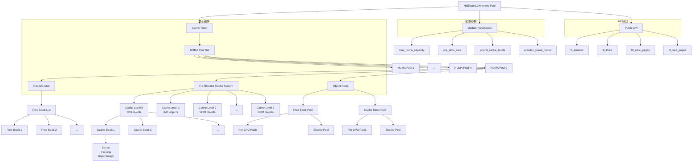
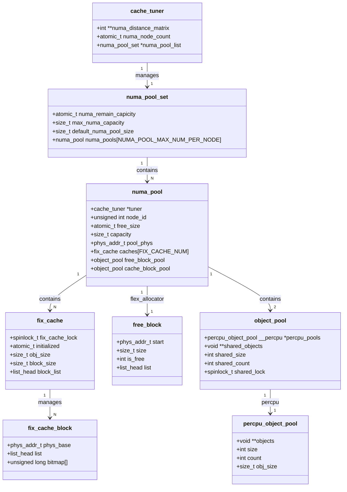
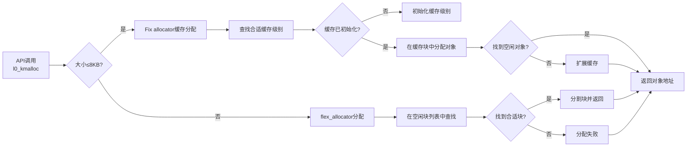

# hisi L0 Memory Pool 使用文档

## 1. 概述

hisi L0 Memory Pool 是一个专为 kunpeng 服务器设计的高性能内存池管理模块。它提供了两种内存管理机制：

1. **Fix Allocator 缓存系统**：用于管理小对象（≤8192 字节）
2. **伙伴系统**：用于管理大对象（>8192 字节）

该模块具有以下特性：
- NUMA 感知的内存分配
- 高性能的内存分配与释放
- 内存碎片管理
- 内核模块参数配置
- 内存使用情况统计和监控

## 2. 模块参数

模块支持以下参数配置：

| 参数名 | 类型 | 默认值 | 描述 |
|--------|------|--------|------|
| `max_numa_capacity` | uint | 20 | 每个 NUMA 节点的最大容量（MB） |
| `pre_alloc_size` | uint | 0 | 预分配内存大小（MB） |
| `preinit_cache_levels` | uint | 0x00 | 预初始化的缓存级别位掩码 |
| `prealloc_numa_nodes` | charp | "" | 预分配的 NUMA 节点列表（逗号分隔） |

### 2.1 参数配置示例

```bash
# 加载模块时指定参数
insmod hisi_l0_mem_pool.ko max_numa_capacity=100 pre_alloc_size=10 preinit_cache_levels=0x0F prealloc_numa_nodes="0,1"
```

## 3. API 接口

### 3.1 内存分配接口

#### l0_kmalloc
```c
void *l0_kmalloc(ssize_t size, int expect_node_id);
```
- **功能**：分配指定大小的内存块
- **参数**：
  - `size`：请求的内存大小（字节）
  - `expect_node_id`：期望的 NUMA 节点 ID
- **返回值**：成功时返回内存指针，失败时返回 NULL

#### l0_alloc_pages
```c
struct page *l0_alloc_pages(ssize_t size, int expect_node_id);
```
- **功能**：分配以页面为单位的内存
- **参数**：
  - `size`：请求的内存大小（字节）
  - `expect_node_id`：期望的 NUMA 节点 ID
- **返回值**：成功时返回 page 结构指针，失败时返回 NULL

### 3.2 内存释放接口

#### l0_kfree
```c
void l0_kfree(void *mem);
```
- **功能**：释放通过 l0_kmalloc 分配的内存
- **参数**：
  - `mem`：要释放的内存指针

#### l0_free_pages
```c
void l0_free_pages(struct page *page);
```
- **功能**：释放通过 `l0_alloc_pages` 分配的页面
- **参数**：
  - `page`：要释放的 page 结构指针


### 3.3 DMA内存申请释放(计划)
#### l0_dma_alloc_coherent
```c
void * l0_dma_alloc_coherent(struct device *dev, size_t size, dma_addr_t *dma_handle, gfp_t gfp, int expect_node_id)
```
- **功能**：分配指定大小的DMA内存
- **参数**：
  - `dev`: 设备结构体指针，表示与DMA操作相关的设备。通常使用驱动程序中设备结构体的指针。
  - `size`: 要分配的内存大小，单位为字节。
  - `dma_handle`: 指向DMA地址的指针，用于存储分配的物理地址。
  - `gfp`: 内存分配标志，如GFP_KERNEL、GFP_ATOMIC等。（这个参数考虑是否保留）
  - `expect_node_id`：期望的L0内存NUMA 节点 ID
- **返回值**：返回CPU可访问的虚拟地址，分配失败时返回NULL。

#### l0_dma_free_coherent

```c
void l0_dma_free_coherent(struct device *dev, size_t size, void *cpu_addr, dma_addr_t dma_handle)
```
- **功能**：分配指定大小的DMA内存
- **参数**：
  - `dev`: 设备结构体指针，表示与DMA操作相关的设备。与申请时相同的设备结构体指针。
  - `size`: 要分配的内存大小，单位为字节。与申请时相同的内存大小。
  - `cpu_addr`: 申请时返回的CPU可访问的虚拟地址。
  - `dma_handle`: 指向DMA地址的指针，用于存储分配的物理地址。
- **返回值**：无返回值


## 4. 使用示例

### 4.1 基本内存分配与释放

```c
#include "hisi_l0_mem_pool.h"

// 分配小对象（使用 Fix Allocator 缓存）
void *ptr = l0_kmalloc(1024, 0);  // 在 NUMA 节点 0 上分配 1KB 内存
if (ptr) {
    // 使用内存
    memset(ptr, 0, 1024);
    
    // 释放内存
    l0_kfree(ptr);
}

// 分配大对象（使用伙伴系统）
void *large_ptr = l0_kmalloc(16384, 1);  // 在 NUMA 节点 1 上分配 16KB 内存
if (large_ptr) {
    // 使用内存
    memset(large_ptr, 0, 16384);
    
    // 释放内存
    l0_kfree(large_ptr);
}
```

### 4.2 页面分配与释放

```c
// 分配页面
struct page *pages = l0_alloc_pages(8192, 0);  // 分配 2 页内存
if (pages) {
    // 获取虚拟地址
    void *vaddr = page_address(pages);
    
    // 使用内存
    memset(vaddr, 0, 8192);
    
    // 释放页面
    l0_free_pages(pages);
}
```

### 4.3 NUMA 感知分配

```c
// 获取当前 CPU 所在的 NUMA 节点
int node_id = numa_node_id();

// 在当前 NUMA 节点上分配内存
void *local_ptr = l0_kmalloc(512, node_id);
if (local_ptr) {
    // 使用内存
    // ...
    l0_kfree(local_ptr);
}
```

## 5. 性能优化建议

### 5.1 缓存级别预初始化
通过 `preinit_cache_levels` 参数预初始化常用缓存级别，提高首次分配性能：
```bash
# 预初始化前 4 个缓存级别（0-3）
insmod hisi_l0_mem_pool.ko preinit_cache_levels=0x0F
```

### 5.2 预分配内存
通过 `pre_alloc_size` 和 `prealloc_numa_nodes` 参数预分配内存，减少运行时分配延迟：
```bash
# 在 NUMA 节点 0 和 1 上各预分配 10MB 内存
insmod hisi_l0_mem_pool.ko pre_alloc_size=10 prealloc_numa_nodes="0,1"
```

## 6. 监控与调试

### 6.1 内存使用情况查看
通过 sysfs 接口查看内存池状态：
```bash
# 触发内存池信息打印到内核日志
echo 1 > /sys/kernel/l0_pool/dump_l0_pool
```

然后查看内核日志：
```bash
dmesg | tail -n 50
```

### 6.2 内核日志信息
模块会在内核日志中输出以下信息：
- 模块加载参数
- NUMA 节点距离排序
- 内存池初始化状态
- 内存分配/释放统计
- 错误和警告信息

## 7. 注意事项

### 7.1 内存对齐
- 分配的内存按页面大小（4KB）对齐
- 小对象分配使用 Fix Allocator 缓存，具有良好的对齐特性

### 7.2 NUMA 节点限制
- 最大支持 64 个 NUMA 节点
- 节点 ID 必须在有效范围内 [0, num_online_nodes())

### 7.3 内存大小限制
- 最大单次分配大小受系统内存限制
- 小对象最大大小：8192 字节
- 大对象通过伙伴系统分配

### 7.4 错误处理
- 所有分配接口在失败时返回 NULL
- 释放 NULL 指针是安全的
- 模块具有完善的错误日志记录

## 8. 故障排除

### 8.1 分配失败
如果内存分配失败，请检查：
1. 系统是否有足够内存
2. 模块参数配置是否正确
3. NUMA 节点是否在线
4. 内存池是否已达到容量上限

### 8.2 性能问题
如果遇到性能问题，请检查：
1. 是否启用了适当的预初始化
2. 是否正确使用 NUMA 感知分配
3. 是否存在内存碎片问题
4. 是否有其他模块竞争内存资源

# 9. 实现架构



## 架构说明

### 1. 核心组件层次结构
1. **Cache Tuner** - 顶层管理器，管理所有 NUMA 节点的内存池
2. **NUMA Pool Set** - 每个 NUMA 节点的内存池集合
3. **NUMA Pool** - 单个 NUMA 节点的内存池，包含伙伴系统和 Fix Allocator 缓存系统
4. **Flex Allocator** - 大对象内存管理（>8KB）
5. **Fix Allocator Cache System** - 小对象内存管理（≤8KB）
6. **Object Pools** - 内部对象池，用于减少分配开销

### 2. 内存管理机制

#### Flex Allocator（伙伴系统）
- 管理大于 8KB 的大对象内存
- 使用 free_block 结构跟踪空闲内存块
- 支持内存块的分割和合并

#### Fix Allocator Cache System（Fix allocator缓存系统）
- 管理小于等于 8KB 的小对象内存
- 包含 10 个缓存级别（32B 到 16KB）
- 每个级别使用fix_cache_block存块
- 使用 bitmap 跟踪对象使用情况

### 3. 优化特性

#### Object Pools（对象池）
- `free_block_pool` - 管理 free_block对象
- `cache_block_pool` - 管理 fix_cache_block对象
- 包含 per-CPU 池和共享池以减少锁竞争

#### NUMA Awareness（NUMA感知）
- 每个 NUMA 节点有独立的内存池
- 支持按距离排序的节点分配策略

#### RCU Optimization（RCU优化）
- 使用 RCU 机制进行无锁读取
- 提高并发性能

### 4. 数据结构关系图



### 5. 主要流程

#### 内存分配流程
